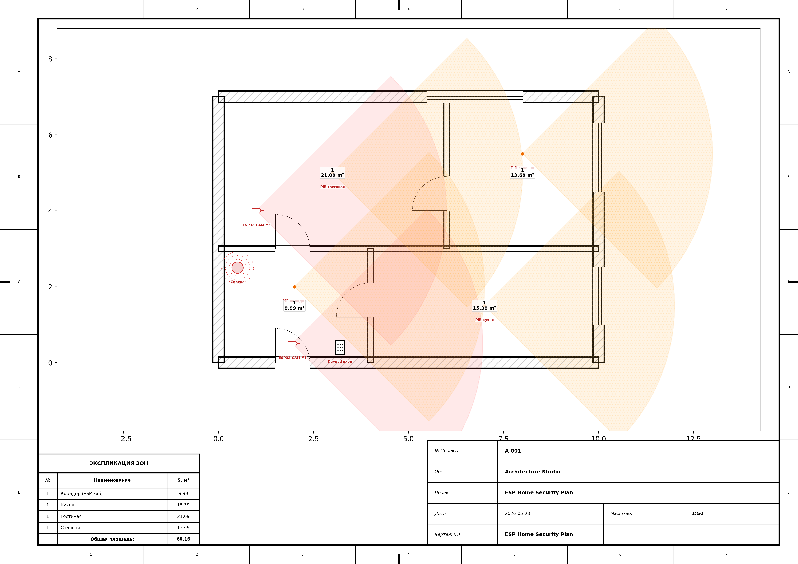

# ESP Home Security System

Бюджетная система безопасности дома на ESP-микроконтроллерах с MQTT, Telegram-уведомлениями и камерами. Полная стоимость сборки: **~$60**.



## Состав системы

| Узел | Контроллер | Функции |
|------|-----------|---------|
| **Hub** (коридор) | ESP32 DevKit V1 | Клавиатура 4x4, сирена, OLED дисплей, MQTT-маршрутизатор |
| **Sensor** (4 шт.) | ESP8266 D1 Mini | PIR датчик движения HC-SR501 + геркон MC-38 (дверь/окно) |
| **Camera** (2 шт.) | ESP32-CAM OV2640 | Фото по срабатыванию, MJPEG-стрим по HTTP |
| **Server** | Raspberry Pi / PC | MQTT-брокер + Telegram-бот + хранилище фото |

## Режимы работы

- **Снят** — датчики молчат, только логирование
- **Охрана (улица)** — все датчики → тревога + сирена + фото
- **Охрана (дома)** — только двери/окна → тревога, PIR игнорируются

Управление: клавиатура на входе (`PIN#` — поставить/снять, `00#` — режим дома) или Telegram-бот.

## Архитектура

```
[ESP8266 sensor x4] ──MQTT──► [ESP32 Hub] ──MQTT──► [Raspberry Pi]
  PIR + геркон                 клавиатура              Mosquitto
  батарея 18650                сирена + OLED           Telegram Bot
                                камера триггер          Flask REST API
[ESP32-CAM x2] ──────────────►────────────────────►   фото хранилище
  MJPEG / JPEG
```

## Быстрый старт

### 1. Сервер

```bash
cd server
cp config.py.example config.py      # заполнить настройки
pip install -r requirements.txt
python server.py
```

Установить MQTT-брокер (macOS):
```bash
brew install mosquitto
echo -e "listener 1883\nallow_anonymous true" > /opt/homebrew/etc/mosquitto/mosquitto.conf
brew services start mosquitto
```

### 2. Прошивка ESP

Установить [PlatformIO](https://platformio.org/), для каждого узла:

```bash
cd firmware/<node-type>
cp config.h.example config.h       # заполнить WiFi + MQTT IP
pio run -t upload
```

### 3. Telegram-бот

1. Написать [@BotFather](https://t.me/BotFather) → `/newbot` → получить токен
2. Узнать свой chat ID: [@userinfobot](https://t.me/userinfobot)
3. Записать в `server/config.py`: `TELEGRAM_TOKEN` и `TELEGRAM_CHAT`

## REST API

| Метод | URL | Описание |
|-------|-----|----------|
| `GET` | `/api/status` | Текущий режим, тревога, последние события |
| `POST` | `/api/command/arm_away` | Поставить на охрану |
| `POST` | `/api/command/arm_home` | Охрана (дома) |
| `POST` | `/api/command/disarm` | Снять с охраны |
| `POST` | `/api/photo/<cam_id>` | Приём фото от камеры |

## Схемы подключений

См. [docs/WIRING.md](docs/WIRING.md) — цоколёвка всех нод, питание, программирование.

## Спецификация железа

| Компонент | Кол-во | Цена/шт | Сумма |
|-----------|--------|---------|-------|
| ESP32 DevKit V1 | 1 | $3.50 | $3.50 |
| ESP8266 D1 Mini | 4 | $2.50 | $10.00 |
| ESP32-CAM OV2640 | 2 | $4.00 | $8.00 |
| HC-SR501 PIR | 4 | $0.80 | $3.20 |
| Геркон MC-38 | 6 | $0.30 | $1.80 |
| Сирена 12V | 1 | $1.50 | $1.50 |
| IRLZ44N MOSFET | 1 | $0.30 | $0.30 |
| Клавиатура 4x4 | 1 | $0.50 | $0.50 |
| OLED SSD1306 | 1 | $1.20 | $1.20 |
| TP4056 + 18650 | 4 | $2.25 | $9.00 |
| MT3608 DC-DC | 4 | $0.20 | $0.80 |
| БП 5V 2A | 2 | $1.50 | $3.00 |
| Raspberry Pi Zero W | 1 | $10.00 | $10.00 |
| MicroSD 8GB | 1 | $3.00 | $3.00 |
| Провода, платы | — | — | $3.70 |
| **Итого** | | | **~$60** |

## MQTT-топики

```
home/security/hub/status          — online/offline (LWT)
home/security/hub/mode            — disarmed/armed_away/armed_home
home/security/hub/alarm           — on/off
home/security/hub/alert           — текст тревоги
home/security/hub/config          — команды: disarm/arm_away/arm_home
home/security/sensor/{id}/motion  — detected/clear
home/security/sensor/{id}/door    — open/closed
home/security/sensor/{id}/window  — open/closed
home/security/sensor/{id}/battery — напряжение (В)
home/security/sensor/{id}/status  — online/offline (LWT)
home/security/camera/{id}/capture — триггер снимка
home/security/camera/{id}/photo   — captured/error
home/security/camera/{id}/status  — online/offline (LWT)
```

## Лицензия

MIT
